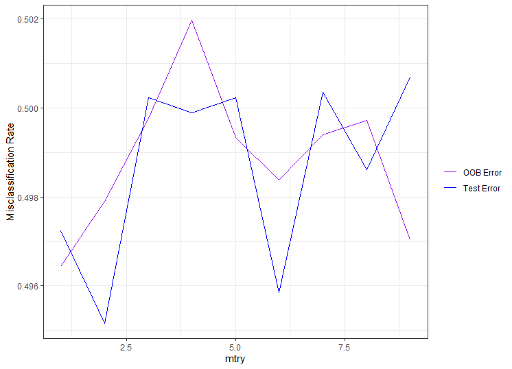
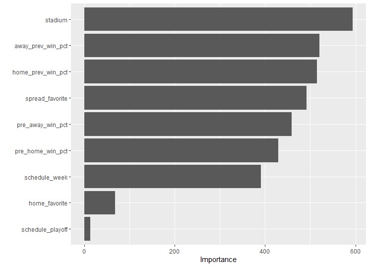

```{r setup, include=FALSE}
knitr::opts_chunk$set(echo = FALSE)
knitr::opts_chunk$set(warning = FALSE)
knitr::opts_chunk$set(message = FALSE)

library(tidyverse)
```

## Executive Summary

This project seeks to construct a model that correctly predicts which team to bet on against the spread in any given NFL game. First, a lot of data wrangling and cleaning was necessary to get my dataset into a workable format for this problem. New columns containing record information for both teams in the game were constructed using that the scores for each game were contained in the dataset. These columns seemed like essentiall predictor variables for the question at hand. 

After this, I built several different models and trained them on the training set (85% of the data from a random split), tuned them using k-fold cross validation. Five of these models are represented in the table below. There are not very large differences between their accuracies, but I was still able to select the best model by choosing the one that had the lowest misclassification rate on the held out test set.

```{r}
load("knn_misclass.rda")
load("multi_logit_misclass.rda")
load("ridge_misclass.rda")
load("boosted_misclass.rda")
load("rf_misclass.rda")

knn_misclass <- knn_misclass %>% pluck("misclass_rate", 1)
multi_log_reg_misclass <- multi_log_reg_misclass %>% pluck("misclass", 1)
ridge_misclass <- ridge_misclass %>% pluck("misclass")

tibble(model = c("KNN", "Multinomial Logit", "Random Forest", "Ridge", "Boosted Tree"),
       misclass_rate = c(knn_misclass, multi_log_reg_misclass, rf_misclass, ridge_misclass, xg_test_misclass)) %>%
  arrange(misclass_rate) %>% knitr::kable()
```

As you can see, my Ridge Classification model was the best model in this regard, and this was the one I selected to use as my model of choice. It does not predict accurately a very large percentage of the time, barely over half. Still, theoretically, if this was applied to a large amount of games, a profit would eventually become clear. However, since this misclassification rate was so close to 50%, I felt it would be prudent to recommend perhaps only making bets on games that the model is more confident about. Since Ridge models report classifications in terms of probability scores for each level of the categorical response variable, it is possible to invetigate the magnitude of confidence the model exhibits.

```{r}

load("ridge_pred_scores.rda")

pred_puller <- function(input_tibble) {
  preds <- as.vector(input_tibble %>%
                       mutate(pred = case_when(
                         DOG.s0 > FAV.s0 & DOG.s0 > PUSH.s0 ~ "DOG",
                         FAV.s0 > DOG.s0 & FAV.s0 > PUSH.s0 ~ "FAV",
                         PUSH.s0 > DOG.s0 & PUSH.s0 > FAV.s0 ~ "PUSH"
                       )) %>% select(pred))
  return(preds)
}

test_dat <- read_csv("data/processed/test_data.csv") %>%
  mutate(result = case_when(bet_result_on_favorite == 1 ~ "FAV",
                            bet_result_on_favorite == -1 ~ "DOG",
                            bet_result_on_favorite == 0 ~ "PUSH"),
         home_favorite = if_else(team_home == team_favorite_id, "Yes", "No")) %>%
  mutate(pre_home_win_pct = if_else(is.nan(pre_home_win_pct), 0, pre_home_win_pct),
         pre_away_win_pct = if_else(is.nan(pre_away_win_pct), 0, pre_away_win_pct),
         home_prev_win_pct = if_else(is.na(home_prev_win_pct), 0.1875, home_prev_win_pct),
         away_prev_win_pct = if_else(is.na(away_prev_win_pct), 0.1875, away_prev_win_pct)) %>%
  select(schedule_week, schedule_playoff, spread_favorite, stadium, home_prev_win_pct,
         away_prev_win_pct, pre_home_win_pct, pre_away_win_pct, home_favorite, result) %>%
  filter(!is.na(result))

preds <- pred_puller(ridge_pred_scores)

test_scores <- test_dat %>%
  mutate(dog_score = ridge_pred_scores$DOG.s0,
         fav_score = ridge_pred_scores$FAV.s0,
         push_score = ridge_pred_scores$PUSH.s0,
         fav_win_pct = ifelse(home_favorite == "Yes", pre_home_win_pct,
           ifelse(home_favorite == "No" & spread_favorite < 0, pre_away_win_pct, NA)),
         dog_win_pct = ifelse(home_favorite == "Yes", pre_away_win_pct,
                              ifelse(home_favorite == "No" & spread_favorite < 0, pre_home_win_pct, NA)),
         diff_win_pct = fav_win_pct - dog_win_pct,
         pred = preds$pred,
         correct = ifelse(pred == result, "Correct", "Incorrect"))

ggplot(ridge_pred_scores) +
  geom_density(aes(DOG.s0, fill = "Underdog"), alpha = 0.5) +
  geom_density(aes(FAV.s0, fill = "Favorite"), alpha = 0.5) +
  labs(
    x = "Prediction Score",
    y = "Density",
    title = "Comparing the Distributions of Scores for Underdogs and Favorites",
    fill = "Team Type"
  ) +
  scale_fill_manual(values = c("red", "green"), ) +
  theme_minimal()
```

This graph shows the distribution of scores for underdogs and favorites as given by the model in the test set. It leans towards predicting underdogs to cover the spread, which is in line with my findings in my EDA that underdogs tend to cover a few percent more of the time than favorites do. Since there is an area of this graph where underdog scores are quite high and there is a slight bump in their frequency, I think placing bets on games who have underdog scores in that vicinity. However, before making a recommendation based on that hunch, it is necessary to examine the success of predictions at different underdog scores (not favorite scores, as the model heavily favors underdogs and recommends basically never betting on a favorite).

```{r}
ggplot(test_scores, aes(dog_score)) +
  geom_density(aes(fill = correct), alpha = 0.3) +
  scale_fill_manual(values = c("green", "red")) +
  labs(
    x = "Underdog Prediction Score",
    y = "Density",
    fill = "Prediction",
    title = "Density of Correct vs. Incorrect Predictions by Underdog Score"
  ) +
  theme_minimal()
```

As you can see, for almost every underdog score, the correct and incorrect prediction distributions are virtually the same. There are a couple of score areas to target for bets, however. Around the 0.99 to 1 range, there tends to be more correct predictions, as well as from around 1.05 to 1.075 (where there is a more significant boost to the correct to incorrect ratio, but at the cost of far fewer games with underdog scores this high). Betting on games in these two ranges over an extended period of time should yield a profit.

## Introduction

In this project, I seek to explore what makes a favorable betting line, and if it is possible to predict which bet will be the winning one for any given NFL game. Some explanation may be needed. For each NFL game, there will be something set called a "spread". This "spread" indicates the favored team to win, and how many points they are projected to win by. By placing a bet on the favorite against the spread, you are betting that they will win by more points than they are projected to. If you bet on the underdog, you are betting that they will either win the game or lose by less points than they are projected to. If the spread is exactly right, then the putcome is called a Push, and the bettors receive their money back.

I built several different models to attempt to predict the outcomes of games. They were predicting whether the favorite (indicated as `FAV`) would win, or if the underdog (indicated as `DOG`) would win. They also were able to predict `PUSH`, but this did not really happen, as pushes are quite rare anyways.

## Data Cleaning, Wrangling and Splitting

This was an extremely long process, and took many lines of code, as you can find in the `Data Wrangling.R` file. Some of the main problems I had to deal with was team IDs being changed when they relocated, and any useful data about team records not being present. However, this dataset contained the outcome of each game in terms of score. This required a lot of wrangling to manipulate around, but I felt that it was obvious that for a prediction problem such as this, the teams' records were essential to have.

I wrangled the data around to create new columns that for every game contained both teams' win percentage going into the game for that season, as well as their previous season win percentage, as the latter I thought is important to consider in earlier weeks in the season. More was necessary, but I shall avoid explaining everything I did in this report.

After accomplishing all of this, I split my data into training and test sets, having the test set be 15% of the data, and then filtered each set to remove games where the spread was not available, so there was no way to predict the result. I then realized I should have done these tasks in reverse order, but it did not matter, as the ratio of training to test data remained basically the exact same, right at 15%. 

Before building my models, I did a tiny bit more wrangling (this is after my EDA as well), and opted to include it in each modeling script rather than go back and change my whole wrangling script. Here is where I made my response variable, called `result`, which contains the levels of "FAV", "DOG", and "PUSH" included above. This response variable is not present in my EDA, as I realized it wsa a better metric than what I used for exploration, while the metric I used for exploration was useful for that purpose. Here is also where I decided how to handle the missingness of the variables I had created myself. Missingness occurred when a team was new and did not have previous data, and for teams in week 1 who had no record that season to compute from yet. I opted to replace the missingness in previous season data with $0.25$, which I thought was a reasonable approximation. Expansion teams usually fair poorly their first season in the league, and giving them a bad record for their previous season (which didn't actually happen) seemed fitting. For the missingness in week 1 data, I took the obvious route and imputed $0$. 

## Model Building

I was not able to build as many models and tune them as much as I would have liked. My computer was taking far too long on even the tuning and cross validation that I did do, where I felt I should just cut my losses and go with what I had. If this had not have been an issue, I would have liked to tune other hyperparameters such as the number of trees in my Random Forest or number of tree iterations in my Boosted Tree. I would have also liked to have constructed a Neural Network.

Obviously, this is a classification problem, and a slightly more complex one than a standard binary, having three levels to the response variable. Of course, I had to think of how I would handle `PUSH`, since it is not really much of a third outcome, but rather a halfway point between the two. Thinking leaving it as a third category would not impact the models much, I left it in as a possible outcome to predict. Before building any of my models, I shrank the amount of possible predictors in my dataset to 9, as they were the only ones that seemed to hold any weight, and my other columns were used for my wrangling or were just purely informational. After this, the columns I was left with were `schedule_week` (the week of the season), `schedule_playoff` (indicator variable for if it was a playoff game), `spread_favorite` (the spread), `stadium` (the stadium the game was being played at), `home_prev_win_pct` (a variable I constructed containing the home team's win percentage from the previous season), `away_prev_win_pct` (same thing but for the away team), `pre_home_win_pct` (a variable I constructed containing the home team's win percentage in the current season prior to the game), `pre_away_win_pct` (same thing but for the away team), `home_favorite` (if the home team was the favorite or not), and my response variable, `result` (can be either "DOG", "FAV", or "PUSH").

#### Multinomial Logistic Regression

Here, I built my simplest model, which was simply building a multinomial logistic regression model using all of my 9 predictors. I used the `multinom()` function from the `nnet` package, as opposed to using `glm()`. 

#### Ridge and Lasso Regressions

Next, I used 10 fold cross validation to select optimal values of lambda for both ridge and lasso regressions. It was a little trickier than normal to pull predictions from these models, as they created three predicted scores for each of the levels of `result`, but I eventually built a helper function that did the trick, and through evaluating on my test set, determined the best of the four models I constructed was the ridge model using a lambda value than minimized misclassification. 

#### K Nearest Neighbors

Next, I tried a KNN approach. Again, I found a new package that worked better for my purposes, as I was having difficulties with cross validating the optimal k-value, and used the `caret` package. I looked at many different k-values, and through using a broader scope and then narrowing in, determined the optimal k-value to be 102. I did this using 10-fold cross validation on my training set at every step. This is not outlandish to use, as the test set has 1523 observations. 

#### Random Forest

Then, I built a random forest model. As I said before, I was unable to tune every parameter, but I was able to tune the most important one, that being `mtry`, which I did through 10-fold cross validation. I left the number of trees to be the default (500), did not tune the depth of the trees, and left the `splitrule` as `"gini"`. I left all nine of my predictors in the formula to be chosen from at each break. After doing this, I was able to graph the results to find the best value of `mtry`. Here is that result:

```{r}

```

As you can see, the best value of `mtry` was 2, so I built a random forest using that on the entire training set, and applied it to my test set. I was also interested to see what this model would tell me about variable importance, so I plotted that as well, and here are those results:

```{r}

```

I think these make sense, but I never would have guessed that the stadium was the most important factor. I figured it would be important, but not that important.

#### Boosted Classification Tree

This was my most time consuming model to build. Before I even could run any cross validation, I needed to get my data into a format that worked. I realized my categorical variables (mostly `stadium`) had factors present in the training set that were not in the test set, and vice versa. This was a problem when using the standard one-hot encoding practice, as the model could not make predictions on the test set. To get around this, I used one of my favorite packages, `fastDummies`, and its accompanying function, `dummy_cols()` to make my categorical variables into dummy variables. I then selected only the columns for test and train that were in both sets, and this allowed the model to be built. 

As I also said before, I was unable to tune every parameter, leaving the iterations of the tree at the default 500, and tree depth to the default 10. I did tune the learning rate, however, using 5-fold cross validation (less folds for faster run speed) on my training set. From the following graph and table, deduced the optimal learning rate to be $0.0000000001$, even though this may not be visible in a `knitr::kable()` table.

```{r}
load("boosted_output.rda")

xg_grouped <- xg_class %>%
  group_by(learn_rate) %>%
  summarise(xg_test_misclass = mean(unlist(xg_test_misclass)))

ggplot(xg_grouped) + 
  geom_line(aes(learn_rate, unlist(xg_test_misclass)))

xg_grouped %>%
  arrange(xg_test_misclass) %>% knitr::kable()
```

So, I used a boosted model with a learn rate of $0.0000000001$, trained it on my training set, and applied it to my test set.

## Model Comparison

After building all of my models, I compared their misclassification rates.

```{r}
load("knn_misclass.rda")
load("multi_logit_misclass.rda")
load("ridge_misclass.rda")
load("boosted_misclass.rda")
load("rf_misclass.rda")

knn_misclass <- knn_misclass %>% pluck("misclass_rate", 1)
multi_log_reg_misclass <- multi_log_reg_misclass %>% pluck("misclass", 1)
ridge_misclass <- ridge_misclass %>% pluck("misclass")

tibble(model = c("KNN", "Multinomial Logit", "Random Forest", "Ridge", "Boosted Tree"),
       misclass_rate = c(knn_misclass, multi_log_reg_misclass, rf_misclass, ridge_misclass, xg_test_misclass)) %>%
  arrange(misclass_rate) %>% knitr::kable()
```

Here, we can see that the best candidate model was the ridge model. None of them performed particularly well, however. If you used this model hundreds of times, you may see yourself making money, but it would take a large sample size, as it does not offer much of an advantage to simply randomly choosing a bet for each game. KNN performed very badly, and it would actually just be better to randomly guess than to use that model, which is strange.

## Further Investigation

Using my best model, I wanted to dig a little deeper and see if there were any trends worth pointing out or tendencies the model exhibited.

Before doing anything else, I wanted to examine an adjusted misclassification rate. Before this, the rates were calculated even when the actual `result` was "PUSH". However, this model never predicted "PUSH" (as it probably should not have), and since you don't lose a push, I opted to remove those rows and recalculate to get a better sense of the performance of the model.

```{r}
load("ridge_pred_scores.rda")

pred_puller <- function(input_tibble) {
  preds <- as.vector(input_tibble %>%
                       mutate(pred = case_when(
                         DOG.s0 > FAV.s0 & DOG.s0 > PUSH.s0 ~ "DOG",
                         FAV.s0 > DOG.s0 & FAV.s0 > PUSH.s0 ~ "FAV",
                         PUSH.s0 > DOG.s0 & PUSH.s0 > FAV.s0 ~ "PUSH"
                       )) %>% select(pred))
  return(preds)
}

test_dat <- read_csv("data/processed/test_data.csv") %>%
  mutate(result = case_when(bet_result_on_favorite == 1 ~ "FAV",
                            bet_result_on_favorite == -1 ~ "DOG",
                            bet_result_on_favorite == 0 ~ "PUSH"),
         home_favorite = if_else(team_home == team_favorite_id, "Yes", "No")) %>%
  mutate(pre_home_win_pct = if_else(is.nan(pre_home_win_pct), 0, pre_home_win_pct),
         pre_away_win_pct = if_else(is.nan(pre_away_win_pct), 0, pre_away_win_pct),
         home_prev_win_pct = if_else(is.na(home_prev_win_pct), 0.1875, home_prev_win_pct),
         away_prev_win_pct = if_else(is.na(away_prev_win_pct), 0.1875, away_prev_win_pct)) %>%
  select(schedule_week, schedule_playoff, spread_favorite, stadium, home_prev_win_pct,
         away_prev_win_pct, pre_home_win_pct, pre_away_win_pct, home_favorite, result) %>%
  filter(!is.na(result))

preds <- pred_puller(ridge_pred_scores)

push_adjusted_misclass <- test_dat %>%
  mutate(pred = preds$pred) %>%
  filter(result != "PUSH") %>%
  summarise(push_adj_misclass = mean(pred != result)) %>% pluck("push_adj_misclass", 1)

push_adjusted_misclass %>% knitr::kable()

test_scores <- test_dat %>%
  mutate(dog_score = ridge_pred_scores$DOG.s0,
         fav_score = ridge_pred_scores$FAV.s0,
         push_score = ridge_pred_scores$PUSH.s0,
         fav_win_pct = ifelse(home_favorite == "Yes", pre_home_win_pct,
           ifelse(home_favorite == "No" & spread_favorite < 0, pre_away_win_pct, NA)),
         dog_win_pct = ifelse(home_favorite == "Yes", pre_away_win_pct,
                              ifelse(home_favorite == "No" & spread_favorite < 0, pre_home_win_pct, NA)),
         diff_win_pct = fav_win_pct - dog_win_pct,
         pred = preds$pred,
         correct = ifelse(pred == result, "Correct", "Incorrect"))
```

This is a slight improvement, as expected, but upon seeing this, I feel a bit better about the model.

Ridge regression models do report their predictions in terms of scores for each category, so I wanted to see if I could look at the actual score distributions of the results, and see if they related to any variables very strongly.

```{r}
ggplot(ridge_pred_scores) +
  geom_density(aes(DOG.s0, fill = "Underdog"), alpha = 0.5) +
  geom_density(aes(FAV.s0, fill = "Favorite"), alpha = 0.5) +
  labs(
    x = "Prediction Score",
    y = "Density",
    title = "Comparing the Distributions of Scores for Underdogs and Favorites",
    fill = "Team Type"
  ) +
  scale_fill_manual(values = c("red", "green"), ) +
  theme_minimal()
```

As expected, the model tended to give higher scores (and therefore predict the outcome to be) underdogs. This was not surprising to me, as I had already seen in my EDA that underdogs tended to be the winning bet more of the time (you will see this in the EDA appendix). Since higher underdog scores mean lower favorite scores, I opted to just choose to look at how underdog scores related to predictors (favorite scores would have the inverse effect).

```{r}
ggplot(test_scores, aes(spread_favorite, dog_score)) +
  geom_point() +
  geom_smooth(se = FALSE) +
  labs(
    y = "Underdog Prediction Score",
    x = "Spread",
    title = "Spread vs Underdog Prediction Score"
  ) +
  theme_minimal()

ggplot(test_scores %>% filter(!is.na(diff_win_pct)), aes(diff_win_pct, dog_score)) +
  geom_point() +
  geom_smooth(se = FALSE) +
  labs(
    y = "Underdog Prediction Score",
    x = "Difference in Win Percentages",
    title = "Win Percentage Difference vs. Underdog Prediction Score"
  ) +
  theme_minimal()
```

Here, we can see no strong correlation between the scores for underdogs and the spread. The second graph contains a y-axis variable I made for the sake of this exploration, which is just the difference between the favorite and underdog's win percentages.

```{r}
ggplot(test_scores, aes(dog_score)) +
  geom_density(aes(fill = correct), alpha = 0.3) +
  scale_fill_manual(values = c("green", "red")) +
  labs(
    x = "Underdog Prediction Score",
    y = "Density",
    fill = "Prediction",
    title = "Density of Correct vs. Incorrect Predictions by Underdog Score"
  ) +
  theme_minimal()
```

Finally, my last plot is simply looking at if a higher underdog prediction score actually results in a correct prediction more of the time. According to this graph, the answer is yes, but only very slightly. This means even with a higher underdog prediction score, you can never start to be extremely confident about any individual bet. However, over a sustained period of time, betting underdogs with high prediction scores from this model should theoretically be fruitful.

## Conclusion

Using this model should theoretically make you money over an extended period of time. I would not recommend ever betting for a favorite unless the model gives a ridiculously high favorite score, which is very uncommon. Betting on underdogs with high underdog scores is the best thing to do with this model. Different bookie websites offer different spreads, and by putting all games and different spreads into the model each week, and betting the highest underdog scores, you should make a decent amount of money over time.

## Appendix - EDA

Here, I will just copy and paste my EDA report that I submitted. Enjoy the interesting findings!

#### Data Overview

All of the data I need for this project came from https://www.kaggle.com/tobycrabtree/nfl-scores-and-betting-data/data#spreadspoke_scores.csv. I said in my data memo that I needed to find a dataset of NFL records so that each game I could have the teams' prior record data, because columns for these predictors were not in my original dataset. However, all I needed was already in there, I just had to unlock it! Since I knew the winner of every game in the dataset, and all games from 1966-2019 were included, I could wrangle the data to construct these columns myself, which I did. In my final, processed dataset, there were 12678 observations and 42 columns. Many of those columns are not useful predictors as they contain the results of the game and were useful for data wrangling.


```{r}
# Loading Packages

library(skimr)
library(knitr)
library(corrplot)

# Loading Data

train_dat <- read_csv(file = "data/processed/training_data.csv")
```


```{r}
skim_without_charts(train_dat) %>% kable()
```

Lets look at the variables with the most missingness.

```{r}
ggplot(data = (train_dat %>% filter(is.na(team_favorite_id) == TRUE)), aes(schedule_season)) +
  geom_bar(fill = "blue") +
  labs(
    x = "Season",
    y = "Number of NAs",
    title = "Missingness in Favored Team"
  ) +
  theme_minimal()

humid_plot <- ggplot(data = (train_dat %>% filter(is.na(weather_humidity) == TRUE)), aes(schedule_season)) +
  geom_bar(fill = "blue") +
  labs(
    x = "Season",
    y = "Number of NAs",
    title = "Missingness in Weather Humidity"
  ) +
  theme_minimal()
    
temp_plot <- ggplot(data = (train_dat %>% filter(is.na(weather_temperature) == TRUE)), aes(schedule_season)) +
  geom_bar(fill = "blue") +
  labs(
    x = "Season",
    y = "Number of NAs",
    title = "Missingness in Weather Temperature"
  ) +
  theme_minimal()     

detail_plot <- ggplot(data = (train_dat %>% filter(is.na(weather_detail) == TRUE)), aes(schedule_season)) +
  geom_bar(fill = "blue") +
  labs(
    x = "Season",
    y = "Number of NAs",
    title = "Missingness in Weather Detail"
  ) +
  theme_minimal() 

wind_plot <- ggplot(data = (train_dat %>% filter(is.na(weather_wind_mph) == TRUE)), aes(schedule_season)) +
  geom_bar(fill = "blue") +
  labs(
    x = "Season",
    y = "Number of NAs",
    title = "Missingness in Weather Wind MPH"
  ) +
  theme_minimal()     

cowplot::plot_grid(humid_plot, detail_plot, temp_plot, wind_plot, ncol = 2)
```

It appears that missingness in temperature and wind speed go hand in hand, you cannot have one without the other. `weather_detail` is mostly missing throughout every season, so it is probably not worth using as a predictor. Thankfully, `team_favorite_id` seems to stop being missing after the 1978 season, which is very convenient. I do find it very strange that there were a few years of no missing temperatures or wind speeds, but then for the most recent season, they all seem to be missing. 

#### Essential Findings

```{r}
train_wo_result <- train_dat %>%
  select(-c(score_home, score_away, winning_team, losing_team, home_team_year, away_team_year,
            home_win, home_loss, away_win, away_loss, post_home_team_wins, post_home_team_losses,
            post_away_team_losses, post_away_team_wins, pre_away_team_losses, pre_away_team_wins,
            pre_home_team_losses, pre_home_team_losses, spread_result, score_sum))

train_wo_result %>% select_if(is.numeric) %>%
  filter_all(any_vars(!is.na(.))) %>%
  cor(use = "pairwise.complete.obs") %>%
  corrplot()
```

It appears that literally every single predictor has practically no correlation with our response variables, `favorite_hit`. `underdog_hit`, and `push`, and the overall big kahuna response variable, `bet_result_on_favorite`, which is constructed to encapsulate the other three. If the favorite hits, it will show a 1, if the underdog hits, it will show a 0, and if the bet pushes, then it shows a 0 (this way pushes aren't counted negatively in any averaging). Let's investigate this main response variable and see what we can learn.

```{r}
train_dat %>% filter(!is.na(favorite_hit)) %>% summarise(fav_bet_mean_result = mean(bet_result_on_favorite)) %>% kable()
```

Here, we can see that across all data, betting the favorite on the spread seems to overall be the wrong choice. It appears that someone betting the favorite will lose their bet $4.01\%$ of the time more than would be expected. A mean of zero here would imply that on average, underdogs and favorites win the same amount of the time. Apparently, this is not true, which is good for us!

```{r}
train_dat %>% filter(!is.na(bet_result_on_favorite)) %>% group_by(schedule_season) %>% 
  summarise(mean = mean(bet_result_on_favorite)) %>%
  ggplot(aes(schedule_season, mean)) +
  geom_point() +
  theme_minimal()
```

Here is a graph showing how this result, but by year to investigate any trends. It seems as if most years hover right around this overall average anyways (early years only have one bettable game, the Super Bowl, so have all-or-nothing proportions).

```{r}
train_dat %>% filter(!is.na(favorite_hit)) %>% group_by(home_favored) %>% summarise(fav_bet_mean_result = mean(bet_result_on_favorite)) %>% kable()
```

Here, we can see that even while, presumably, home field advantage is taken into account by betting odds makers, they still undervalue it. When the home team is favored, they tend to cover the spread $5.2\%$ more of the time than favored away teams, suggesting favored home teams are safer bets, and that underdogs are better bets when they are at home, which makes sense. However, it is good news for us that these results indicate that betting odds-makers are not accurately assessing the value of home field advantage. While this result makes sense intuitively, we would actually expect home field advantage to already properly be taken into account.

```{r}
train_dat %>% filter(!is.na(favorite_hit)) %>% group_by(schedule_playoff) %>%
  summarise(fav_bet_mean_result = mean(bet_result_on_favorite)) %>% kable()
```

Here, we can see that in the playoffs, favorites cover the spread more than before. A good amount more, actually. $2.74\%$ more than in the regular season. So, betting the favorites during the playoffs is a better idea than in the regular season, although this mean result is still negative, implying someone should still avoid it. Perhaps in the playoffs, it is best to avoid betting the underdogs as much as in the regular season, where it is much more advantageous.

```{r}
train_dat %>% filter(!is.na(bet_result_on_favorite)) %>% group_by(schedule_week) %>%
  summarise(fav_bet_mean_result = mean(bet_result_on_favorite)) %>%
  ggplot(aes(fav_bet_mean_result, 
             factor(schedule_week, levels = c("1", "2", "3", "4", "5", "6", "7", "8", "9", "10", "11", "12", "13",
                                              "14", "15", "16", "17", "18", "Wildcard", "Division", "Conference", "Superbowl")))) +
  geom_col(aes(fill = fav_bet_mean_result), show.legend = FALSE) +
  labs(
    x = "Bet Result Average on Favorite",
    y = "Week of Season"
  ) +
  theme_minimal()
```

Here, we can see some per-week averages. Week 18 should be disregarded, it it was a one time week of 10 games played in the 1993 season as an experiment. It appears that odds makers get slightly better at levelling the playing field in favor of the favorites as the season progresses, and they do so too much in the Super Bowl and conference championship games. In the early stages of the regular season, and especially during the wild card round of the playoffs, it seems that it is much better to bet on underdogs. I wonder why week 6 is so lucrative for them!

#### Secondary Findings

```{r}
train_dat %>% filter(!is.na(over_under_line)) %>% 
  ggplot(aes(over_under_line, score_sum)) +
  geom_point(alpha = 0.2) +
  geom_abline(slope = 1, intercept = 0, color = "red") +
  annotate(geom = "text", label = "y = x", x = 65, y = 70, color = "red") +
  labs(
    x = "Over Under for Game",
    y = "Total Points Scored in Game"
  ) +
  theme_minimal()
```

This is a graph of all games with an over-under reported, and the actual total score from that game. A line is provided for reference of when these two would be equal. I was curious if more often than not, the over-under hits the over or the under.

```{r}
train_dat %>% filter(!is.na(over_under_line)) %>%
  mutate(result = if_else(score_sum > over_under_line, "Over Hit",
                          if_else(score_sum < over_under_line, "Under Hit", "Push"))) %>%
  group_by(result) %>%
  count() %>%
  mutate(prop = n / 8617) %>% kable()
```

It appears that betting the under is about $1.2\%$ better than the over, on average. I tried running a few regressions to see if I could find any patterns in the over-under that might be useful, but the $R^2$ values from all of those models was much too low.

```{r}
train_dat %>% filter(!is.na(bet_result_on_favorite)) %>%
  group_by(team_favorite_id) %>%
  summarise(mean_result_on_favorite = mean(bet_result_on_favorite)) %>% 
  arrange(desc(mean_result_on_favorite)) %>% knitr::kable()
```

Here, I was curious which teams perform the best as favorites. This shows that the best team, historically, to bet on as a favorite was the Phoenix Cardinals. In that name they only played for 6 seasons, however, which explains why their result is so much better than the other teams. So, in this category, I will crown my home town Green Bay Packers the best team to bet on as a favorite. The worst team, historically, is the Baltimore Colts, but again, we only have a few years of data for them. So, taking the unfortunate cake as the worst is the Arizona Cardinals. Next, I was curious about udnerdogs.

```{r}
train_dat %>% filter(!is.na(bet_result_on_favorite)) %>%
  mutate(team_underdog_id = if_else(team_favorite_id == team_home, team_away, if_else(
      team_favorite_id == team_away, team_home, "PICK"
    ))) %>%
  group_by(team_underdog_id) %>%
  summarise(mean_result_on_favorite = mean(bet_result_on_favorite)) %>% 
  arrange(mean_result_on_favorite) %>% knitr::kable()
```

The results at the top here are a bit muddled. `PICK` merely is where the line has the teams as equally likely to win, so we will disregard this. the Los Angeles Raiders existed for about 15 seasons, so this is a good amount of data, but since they do not exist by that name anymore, and their Oakland variation is much further down, I cannot crown them here. Nor can I crown the LA Chargers, having only three seasons of data by that name. So, the crown of the best underdog to bet goes to the Pittsburgh Steelers! The underdog you should not want to bet appears to be a common trend amongst St. Louis teams, however, and since the Arizona and Phoenix variations of the cardinals are also down there, as well as the Los Angeles variation of the Rams, this is a harder decision. But, I have to give it to the Rams, as a historical franchise, as they have by far the worst overall when they were in St. Louis, and their Los Angeles variant is much worst than the Arizona variant of the cardinals. Close call to the cardinals, as they almost got the worst in both categories!

This is interesting to look at historically, but I do not think that it would be particularly useful for model building. I suppose down the line I could try one-hot encoding each team to its own dummy variable and see if it is actually useful, but the context of each team at the time is much more important than its overall results.

